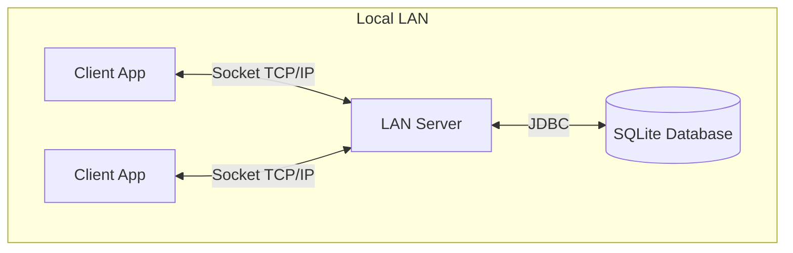

# Java LAN Messenger
**LAN-based Real-Time Communication System**

**A Project Report**
Submitted in partial fulfillment of the requirements for the course
**Software Development Project**

by

**Simanto Sorkar**
**0322320105101003**

Approved as to style and content by
............................................
**Project Supervisor**

**Department of Computer Science and Engineering**
**23 May 2026**

---

## DEDICATION
We dedicate this project to our respected teachers and mentors who have continuously guided us in the pursuit of knowledge and technical excellence.

---

## ACKNOWLEDGEMENT
We would like to express our sincere gratitude to our project supervisor for their invaluable guidance, insightful feedback, and continuous support throughout the development of the Java LAN Messenger application. Their encouragement has been instrumental in the successful completion of this work.

---

## ABSTRACT
Java LAN Messenger is a standalone desktop application designed for real-time messaging over a Local Area Network (LAN). It provides a secure, efficient, and decentralized communication platform without the need for external server infrastructure. The system is built using Core Java, leveraging Swing for a modern, responsive user interface and Java Sockets for low-latency communication. Data persistence is managed via an SQLite database, ensuring that user account information and chat history remain local. 

The architecture follows a client-server model where a dedicated server handles socket connections and message broadcasting, while client applications provide the frontend experience. Security is enforced through password hashing and the use of prepared statements to prevent SQL injection. This project demonstrates the effective application of multi-threaded network programming, GUI design, and local database management in Java.

---

## TABLE OF CONTENTS
1. Dedication ........... 2
2. Acknowledgement ........... 3
3. Abstract ........... 4
4. CHAPTER 1: Introduction ........... 5
   - 1.1 Overview ........... 5
   - 1.2 Motivation ........... 5
   - 1.3 Objectives ........... 5
5. CHAPTER 2: System Analysis and Design ........... 6
   - 2.1 System Architecture ........... 6
   - 2.2 Database Design ........... 6
   - 2.3 Communication Protocol ........... 7
6. CHAPTER 3: Implementation ........... 8
   - 3.1 Technology Stack ........... 8
   - 3.2 Security Measures ........... 8
7. CHAPTER 4: Conclusion ........... 9

---

## CHAPTER 1: INTRODUCTION

### 1.1 Overview
Java LAN Messenger is a localized communication tool enabling real-time text and file sharing between users connected to the same network. It eliminates dependency on cloud servers, ensuring privacy and speed.

### 1.2 Motivation
In environments where internet access is restricted or privacy is paramount, a LAN-based messaging system provides a reliable and secure alternative to public messaging services.

### 1.3 Objectives
- Develop a robust multi-threaded server capable of handling multiple client connections.
- Design an intuitive Swing-based GUI for login, registration, and messaging.
- Implement secure storage for user data and chat history using SQLite.

---

## CHAPTER 2: SYSTEM ANALYSIS AND DESIGN

### 2.1 System Architecture
The application adopts a Client-Server architecture:
- **Server:** Manages socket connections, broadcasts active user lists, and routes messages.
- **Client:** Connects to the server to send/receive messages, perform authentication, and manage chat history.

**Architectural Flowchart:**

### 2.2 Database Design
The SQLite database stores user credentials and chat history via the following tables:

**Users Table (`users`):**
* `id` (INTEGER, PRIMARY KEY)
* `username` (TEXT, UNIQUE)
* `password` (TEXT, Hashed)
* `status` (TEXT, DEFAULT 'OFFLINE')
* `profile_pic` (TEXT, Base64)

**Messages Table (`messages`):**
* `id` (INTEGER, PRIMARY KEY)
* `sender` (TEXT, FK to users)
* `receiver` (TEXT, FK to users)
* `message` (TEXT)
* `file_name` (TEXT)
* `file_blob` (TEXT, Base64)
* `created_at` (TIMESTAMP)

### 2.3 Communication Protocol
Messages are transmitted as strings over TCP/IP sockets, using custom `CMD_` prefixes (e.g., `CMD_LOGIN`, `CMD_MSG`, `CMD_FILE`) to route packets correctly across the network.

---

## CHAPTER 3: IMPLEMENTATION

### 3.1 Technology Stack
- **Language:** Java (JDK 8+)
- **GUI:** Java Swing
- **Networking:** `java.net.ServerSocket`, `java.net.Socket`
- **Database:** SQLite (Xerial JDBC driver)
- **Build Tool:** Maven

### 3.2 Security Measures
- **Password Hashing:** Passwords are hashed using SHA-256 with static salt before storage.
- **SQL Injection Prevention:** All database operations utilize `PreparedStatement`.

---

## CHAPTER 4: CONCLUSION
The Java LAN Messenger project successfully achieves a functional, secure communication system suitable for localized networks. It serves as a practical implementation of fundamental network programming concepts and secure application development.
